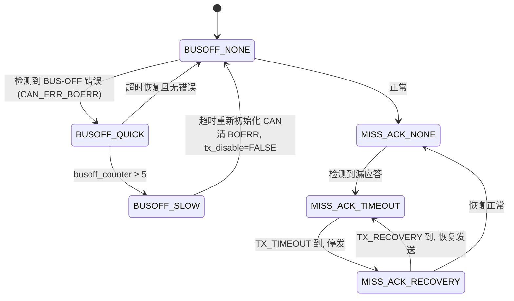

# 充电与功率分配控制状态机

> 基于 `CanProc` / `vcu_canbox_cur` / `CanRecoveryProc` 的代码逆向建模

## 一、状态机概述

充电站主控在每个调度周期调用 `CanProc()`（`can.c`）。该函数并非线性流程，而是一个由定时器驱动的
周期性控制状态机：在“总线在线监测”守卫下，不断完成“设备数据采集 → 充电使能广播 → 总功率测算 →
功率分配决策 → 逐设备下发”等动作；同时监测子设备的在线/失联状态。CAN 总线离线（BUS-OFF）
恢复作为并发守卫子状态机，离线期间禁止一切下发。该状态机与上述“功率动态分配算法”紧密衔接——
功率分配决策与逐设备下发正是功率分配算法的载体。

## 二、状态定义

| 状态 | 说明 | 代码位置 |
|------|------|----------|
| S0 初始化 | 上电/复位后调用 `CanRamInit()` 清零各 BMS/AP/电量结构体与定时器，进入运行。 | `can.c` CanRamInit / 启动 |
| S1 总线监测 | `CanRecoveryProc()`：检测 BUS-OFF 与漏应答(MISS_ACK)，维护 `BUSOFF_NONE/SLOW/QUICK` 与 `MISS_ACK_*` 子状态，离线时 `tx_disable=TRUE`。 | `can.c:81-182` |
| S2 数据采集 | 解析 BMS/AP 报文，刷新 `g_SlotBmsInfor[i].Soc`、`ChargeCurrent` 与 `g_BmsSysAP[i]` 额定值；统计在线数 `bat_act_number` 与最大 SOC 设备 `max_soc_numb`。 | `can.c:617-634` |
| S3 使能广播 | 每 10s(`t200ms≥10000`) 调 `vcu_canbox_mode()` 向 `0x1806E640` 广播：`PaygGetPayState()` 决定 `TargetChargeVoltageH`(0xff=暂停)，`power>1.0` 置 `ChargeEnable=0x55`。 | `can.c:702-706` / `507-542` |
| S4 总功率测算 | 每 5s(`t500ms≥5000`) 累加 Σ(`ap_vol[i]`×`ap_cur[i]`)，得到 `total_power_all = 总和/1e7`。 | `can.c:710-723` |
| S5 分配决策 | 读取设置功率 `power`，与 `total_power_all` 比较：≥ 则全额定；< 则按 SOC 从大到小动态分配剩余功率。 | `can.c` `vcu_canbox_cur:552` |
| S6 逐设备下发 | 遍历 `i=0…CHARGE_NUM-1`，`candi=0x1803F000+i`；电压=额定、电流=分配/额定，`ChargeEnable=(power>1.0 且电流>0)?0x55:0`，`CanTransmit` 发送 8 字节。 | `can.c` `vcu_canbox_cur:629-644` |
| S7 失联处理 | `g_BmsLostTimeCount[i]≥6` 的子设备判定离线，清零其 SN 与 `g_SlotBmsInfor[i]`，退出本轮分配。 | `can.c:1393-` |

## 三、状态转移表

| 当前状态 | 触发条件 | 动作 / 事件 | 下一状态 |
|----------|----------|-------------|----------|
| S0 初始化 | 上电 / 复位 | `CanRamInit` 清结构体与定时器 | S1 总线监测 |
| S1 总线监测 | 每个 `CanProc` 周期 | 检测 BUS-OFF/漏应答；离线则 `tx_disable` | S2 数据采集 |
| S1 总线监测 | 检测到 BUS-OFF 错误 | 进入 `BUSOFF_SLOW/QUICK` 子状态 | S1(离线,禁止下发) |
| S1 总线监测 | 超时恢复且无错误 | `busoff_state=BUSOFF_NONE`, `tx_disable=FALSE` | S2 数据采集 |
| S2 数据采集 | 每周期 | 刷新 SOC/电流/额定值、在线数、最大SOC | S3/S4/S5/S6(按定时器) |
| S2 数据采集 | 某设备 `LostTime≥6` | 清零该设备数据 | S7 失联处理 → S2 |
| S3 使能广播 | `t200ms≥10000`(10s) | `vcu_canbox_mode` → `0x1806E640` | S2 数据采集 |
| S4 总功率测算 | `t500ms≥5000`(5s) | 算 `total_power_all` | S5 分配决策 |
| S5 分配决策 | `power ≥ total_power_all` | 全部 `out_cur=额定` | S6 逐设备下发 |
| S5 分配决策 | `power < total_power_all` | 按 SOC 排序动态分配剩余功率 | S6 逐设备下发 |
| S6 逐设备下发 | 完成遍历发送 | `CanTransmit` 各子设备 | S2 数据采集 |

## 四、状态转移图

### 4-A 主控制状态机

```mermaid
flowchart TD
    S0([S0 初始化<br/>CanRamInit]) --> S1[S1 总线监测<br/>CanRecoveryProc<br/>BUSOFF_NONE/SLOW/QUICK]
    S1 --> S2[S2 数据采集<br/>刷新 Soc/电流/额定值<br/>统计在线数 & 最大SOC]
    S2 --> BR{定时器分支判断}
    BR -- t200ms≥10s 10s --> S3[S3 使能广播<br/>vcu_canbox_mode → 0x1806E640<br/>PaygGetPayState 门控 / power>1.0 使能]
    BR -- t500ms≥5s 5s --> S4[S4 总功率测算<br/>total_power_all = Σ ap×cur /1e7]
    S4 --> S5{S5 分配决策<br/>power ≥ total_power_all ?}
    S5 -- 是 充足 --> G[全额定下发<br/>out_cur[i]=ap_cur[i]]
    S5 -- 否 不足 --> D[按 SOC 从大到小<br/>动态分配剩余功率<br/>电流=剩余/额定电压]
    G --> S6[S6 逐设备下发<br/>candi=0x1803F000+i<br/>电压=额定,电流=分配<br/>ChargeEnable=power>1.0&&cur>0?0x55:0]
    D --> S6
    S3 --> S2
    S6 --> S2
    S2 -. LostTime≥6 .-> S7[S7 失联处理<br/>清零设备数据] --> S2
```

### 4-B CAN 总线离线恢复子状态机（S1 守卫）



## 五、关键说明

1. **守卫关系**：S1 总线监测是全局守卫。只有 `busoff_state==BUSOFF_NONE` 且 `tx_disable==FALSE` 时，S3/S6 的下发才真正有效；离线期间所有 `CanTransmit` 被抑制。
2. **并发而非互斥**：S2 每周期都执行；S3（10s）与 S4/S5/S6（5s）按各自定时器触发，互相穿插，并非严格串行排队。
3. **支付门控**：S3 使能广播受 `PaygGetPayState()` 约束——未付费时 `TargetChargeVoltageH` 置 `0xFF`（暂停），设备据此停止充电。
4. **功率门控**：`power>1.0` 才允许 `ChargeEnable=0x55`；分配结果为 0 电流的设备同样被置为不使能，自然退出充电。
5. **失联自愈**：S7 仅清零离线设备数据并使其退出本轮分配，不影响其他在线设备的功率分配与下发。
6. **与功率分配算法的衔接**：S5/S6 正是《充电功率动态分配算法说明》中流程图的具体实现，决策与下发逻辑完全一致。

## 六、与《充电功率动态分配算法说明》的对应关系

| 算法文档步骤 | 本状态机环节 | 代码 |
|--------------|--------------|------|
| 读取设置功率 / 量纲换算 | S5 分配决策 | `vcu_canbox_cur:564-596` |
| SOC 排序（大者优先） | S2 数据采集 + S5 | `g_bat_soc` / `soc_order` |
| `power≥total` 全额定 | S5→S6 充足分支 | `vcu_canbox_cur:598-601` |
| 功率不足动态分配 | S5→S6 不足分支 | `vcu_canbox_cur:603-627` |
| 逐设备下发电压/电流/使能 | S6 逐设备下发 | `vcu_canbox_cur:629-644` |
